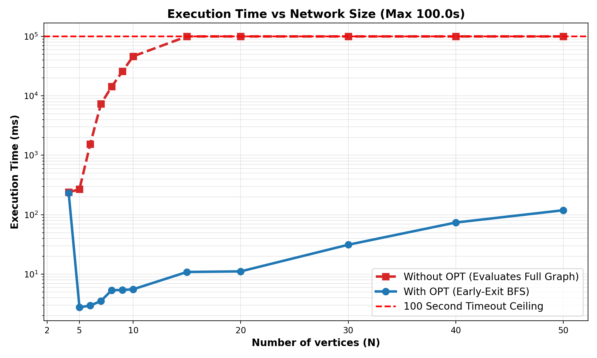

# Reconfiguration of Spanning Trees with Diameter Constraints 🌳 ⚡

**Bachelor Thesis Project (BTP)**
**Author:** Parth Dodiya | **Supervisor:** Dr. Joy Chandra Mukherjee  
School of Electrical Sciences, IIT Bhubaneswar

---

## 📖 Expanded Overview & Background

This repository contains an optimized C++ implementation and Python visualization pipeline for solving the **Spanning Tree Reconfiguration** problem under strict diameter constraints.

### The Core Concept
A spanning tree is a routing path that connects all nodes in a network without creating any loops (cycles). The **Reconfiguration Problem** asks: *Given a network graph $G$, an initial routing tree $T_s$, and a target routing tree $T_t$, can we transform $T_s$ into $T_t$ one step at a time?* A single "step" is an **Edge Flip**—adding one new connection and immediately removing an old one to maintain the tree structure. 

### The Diameter Constraint
Without constraints, transforming a tree is always possible. However, in real-world networking (like SDN controllers), long paths cause unacceptable data delay. Therefore, we introduce a **Diameter Constraint ($d$)**. The diameter is the longest path between any two nodes. 

Our engine guarantees that during the transformation, the diameter of **every single intermediate tree** never exceeds $d$. This ensures zero-downtime and strict SLA compliance during network routing updates.

While mathematically proven to be solvable, the original theoretical approach requires evaluating a massive $\mathcal{O}(|E|^4)$ state space. **The primary contribution of this project is the engineering of system-level optimizations (Early BFS and Global Caching) to bridge the gap between theoretical solvability and practical, sub-second execution speeds.**

---

## 📂 Repository Architecture & Core Files

The codebase is cleanly divided into core C++ solvers, data files, and a Python testing/visualization suite.

### The C++ Solvers
* **`rst_cons.cpp` (Fully Optimized Engine):** The crown jewel of the project. Implements the constrained research paper approach featuring **Early BFS optimization** and **Global Dijkstra Caching**. It halts state-space generation the millisecond the target is reached.
* **`rst_unopt.cpp` (Partially Optimized Baseline):** Implements the constrained research paper approach utilizing Global Dijkstra Caching *only*. Used specifically to benchmark the massive performance impact of the Early BFS architecture.
* **`rst_naive.cpp` (Unconstrained Baseline):** Implements a standard "symmetric difference" approach. Serves as a control baseline to demonstrate how simple reconfiguration behaves when diameter constraints are completely ignored.

### The Python Pipeline
* **`gen_input.py`:** Programmatically generates random connected graphs, extracts valid distinct spanning trees, and calculates safe diameter bounds to feed into the C++ engines.
* **`compare.py`:** Cross-analyzes the text outputs of the naive approach versus the constrained approach. It highlights step-count differences and explicitly proves how the naive approach violates the $d$ limit.
* **`benchmark.py`:** The scalability profiler. It automatically routes inputs from `gen_input.py` through `rst_cons.cpp` and `rst_unopt.cpp`, logging execution times and plotting a comparative performance graph.
* **`visualizer.py`:** The topological validator. It ingests the final sequence from the optimized engine to dynamically render each intermediate pseudotree and outputs an animated video.

### Data & Output Files (`data/` directory)
* **`input.txt`:** A generated sample test case containing the graph structure, $T_s$, $T_t$, and $d$.
* **`output_constrained.txt`:** The verified, safe sequence of edge flips generated by `rst_cons.cpp`.
* **`output_naive.txt`:** The unconstrained, unsafe sequence generated by `rst_naive.cpp`.

---

## 🎥 Visual Proof & Scalability

### Reconfiguration Execution Animation
Unlike theoretical algorithms that simply output "YES/NO", this pipeline explicitly maps the safe operational sequence. The animation below visually verifies the eccentricity of every node at each discrete step, proving the diameter constraint is maintained.

  <video width="700" autoplay loop muted playsinline>
    <source src="assets/sequence_animation.mp4" type="video/mp4">
  </video>

### Performance Speedup
The empirical benchmarking below demonstrates the exponential time complexity of the theoretical baseline versus the sub-second performance of our engineered Early BFS optimization.

  

---

## ⚙️ Execution Guide

### 1. Compilation
Compile the three C++ engines using `g++` (C++17 recommended) from the root directory:

    g++ rst_naive.cpp -o rst_naive
    g++ rst_unopt.cpp -o rst_unopt
    g++ rst_cons.cpp -o rst_cons

### 2. Generating Solutions
Run the compiled executables against the sample input file located in the `data/` folder. The outputs are routed to their respective text files:

**Run the Unconstrained Baseline:**

    ./rst_naive data/input.txt > data/output_naive.txt

**Run the Unoptimized Constrained Approach:**

    ./rst_unopt data/input.txt

**Run the Fully Optimized Constrained Approach:**

    ./rst_cons data/input.txt > data/output_constrained.txt

### 3. Analysis & Visualization

**Validate and Compare Approaches:**
*(Reads `data/output_constrained.txt` and `data/output_naive.txt`)*

    python3 compare.py

**Generate the Visual Animation:**
*(Requires `data/input.txt` and `data/output_constrained.txt`)*

    python3 visualizer.py data/input.txt data/output_constrained.txt

**Run the Benchmarking Suite:**
*(Automatically runs `gen_input.py`, `./rst_cons`, and `./rst_unopt` internally)*

    python3 benchmark.py

---

## 📜 References
* Bousquet, N., Ito, T., Kobayashi, Y., Mizuta, H., Ouvrard, P., Suzuki, A., & Wasa, K. (2022). *Reconfiguration of Spanning Trees with Degree Constraint or Diameter Constraint*. 39th International Symposium on Theoretical Aspects of Computer Science (STACS 2022). Leibniz International Proceedings in Informatics (LIPIcs), Volume 219.